# tableRwd處理方法彙整


## 一：使用css隱藏不重要數據列

處理前：
   
   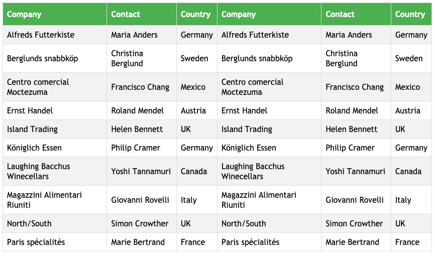

處理後：
   
   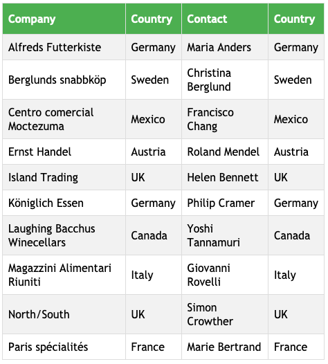

實現方式：
```html
    <!-- 增加以下css -->
    @media only screen and (max-width: 800px) {
        table td:nth-child(2),
        table th:nth-child(2) {display: none;}
    }
    @media only screen and (max-width: 640px) {
        table td:nth-child(4),
        table th:nth-child(4),
        table td:nth-child(7),
        table th:nth-child(7),
        table td:nth-child(8),
        table th:nth-child(8){display: none;}
    }
```

## 以用戶角度思考，每個人對數據的認知不同，或許你隱藏的數據對於他卻是很重要的。所以這種方法不推薦。

*  [範例](http://www.milky-sky.com/brangista/tableRwdShare/%E9%9A%B1%E8%97%8F%E4%B8%8D%E9%87%8D%E8%A6%81%E6%95%B8%E6%93%9A%E5%88%97.html)  

* * *

## 二：使用破壞表格方式“data-title”

PC狀態

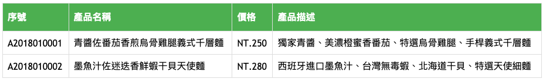

mobile狀態

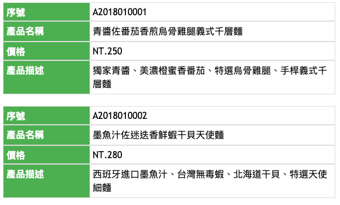


就是將原本的 thead 隱藏，使用 data-* 以及將 td 用 display: block 來排版。

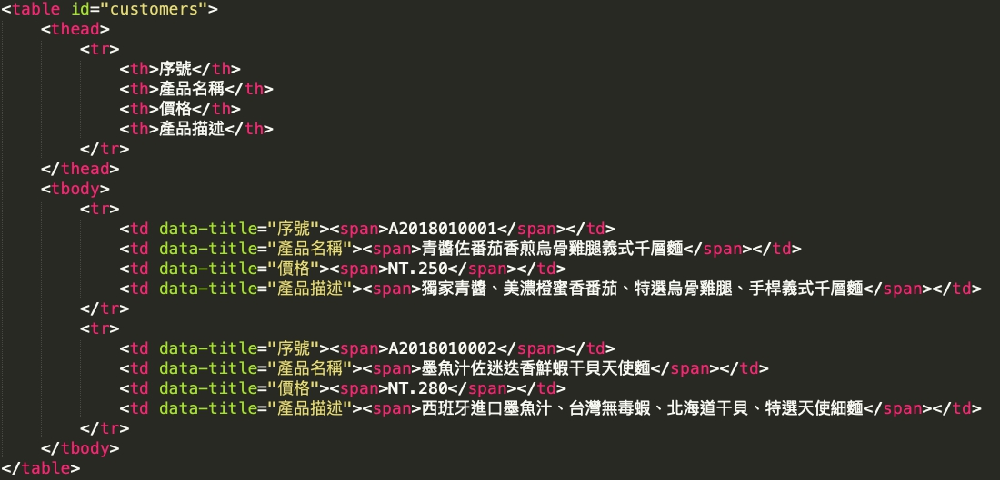

## 資訊清楚，但可能會產生表格攏長問題。
*  [範例](http://www.milky-sky.com/brangista/tableRwdShare/dataTitle.html)  

* * *

## 三：橫向scroll表格

處理後，只要超過指定的table最小寬度，右邊自動會出現透明漸層底：
   
   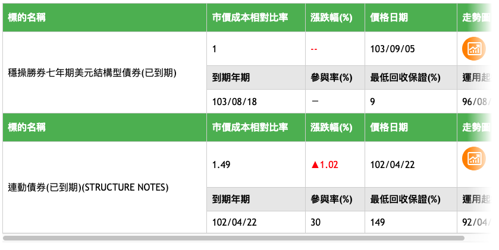

scroll滑到最右邊時漸層消失：

   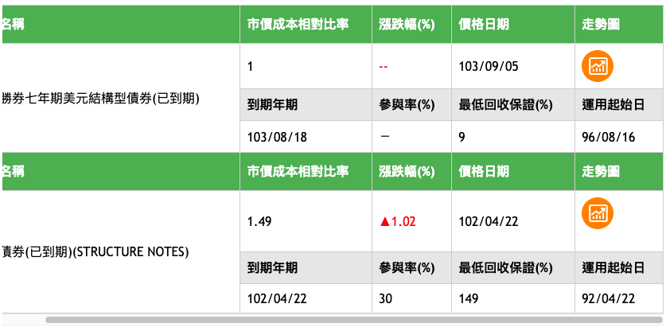


實現方式：
```html
    <!-- 載入以下css及js -->
    <script type="text/javascript" src="js/jquery.min.js"></script>
    <link rel="stylesheet" type="text/css" media="all" href="css/mainStyle.css" />
    <script type="text/javascript" src="js/pageTable.js"></script>

    <!-- 表格部分的框架 -->
    <div class="container-item">
        <div class="container-block customers">
            <table width="100%" class="customersTable" id="customers">
                ....
            </table>
        </div>
        <div class="red show"></div>
    </div>
```

*  [範例](http://www.milky-sky.com/brangista/tableRwdShare/fglife_TableRwd/scrollX.html)  

* * *


## 四：固定左方首列，剩餘列橫向滾動 
   
   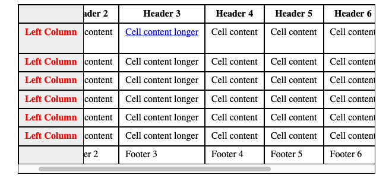


實現方式：
```html
    <!-- 載入以下css及js -->
    <script type="text/javascript" language="javascript" src="jquery.min.js"></script>
    <style>
	.table-scroll {
		position:relative;
		max-width:600px;
		margin:auto;
		overflow:hidden;
		border:1px solid #000;
	}
	.table-wrap {
		width:100%;
		overflow:auto;
	}
	.table-scroll table {
		width:100%;
		margin:auto;
		border-collapse:separate;
		border-spacing:0;
	}
	.table-scroll th, .table-scroll td {
		padding:5px 10px;
		border:1px solid #000;
		background:#fff;
		white-space:nowrap;
		vertical-align:top;
	}
	.table-scroll thead, .table-scroll tfoot {
		background:#f9f9f9;
	}
	.clone {
		position:absolute;
		top:0;
		left:0;
		pointer-events:none;
	}
	.clone th, .clone td {
		visibility:hidden
	}
	.clone td, .clone th {
		border-color:transparent
	}
	.clone tbody th {
		visibility:visible;
		color:red;
	}
	.clone .fixed-side {
		border:1px solid #000;
		background:#eee;
		visibility:visible;
	}
	.clone thead, .clone tfoot{background:transparent;}
   </style>
   <script>
      // requires jquery library
      jQuery(document).ready(function() {
         jQuery(".main-table").clone(true).appendTo('#table-scroll').addClass('clone');   
      });
   </script>

    <!-- 表格部分的框架 -->
    <div id="table-scroll" class="table-scroll">
	  <div class="table-wrap">
		<table class="main-table">
		  <thead>
			<tr>
			  <th class="fixed-side" scope="col">&nbsp;</th>
			  <th scope="col">Header 2</th>
			  ....
			</tr>
		  </thead>
		  <tbody>
			<tr>
			  <th class="fixed-side">Left Column1</th>
			  <td>Cell content<br>
				test<br>
				test</td>
			  <td><a href="#">Cell content longer</a></td>
			  <td>Cell content</td>
			  ....
			</tr>
			<tr>
			  <th class="fixed-side">Left Column2</th>
			  <td>Cell content</td>
			  ....
			</tr>
			<tr>
			  <th class="fixed-side">Left Column3</th>
			  <td>Cell content</td>
			  ....
			</tr>
		  </tbody>
		  <tfoot>
			<tr>
			  <th class="fixed-side">&nbsp;</th>
			  <td>Footer 2</td>
			  ....
			</tr>
		  </tfoot>
		</table>
	  </div>
	</div>
```

   
   
*  [範例](http://www.milky-sky.com/brangista/tableRwdShare/leftFixed/Untitled-2.html)  

* * *

## 五：結合第三點的漸層表格及第四點的左方或是右方首列固定而產生的表格_（lotte研究）

   
*  [左方首列固定](http://www.milky-sky.com/brangista/tableRwdShare/tableRWD_lotteShare/index.html)  
*  [右方首列固定](http://www.milky-sky.com/brangista/tableRwdShare/tableRWD-right/index.html)  

* * *
  
## 六：固定上方首列，剩餘列橫向滾動，讓使用者自行勾選想隱藏的數據列
   
   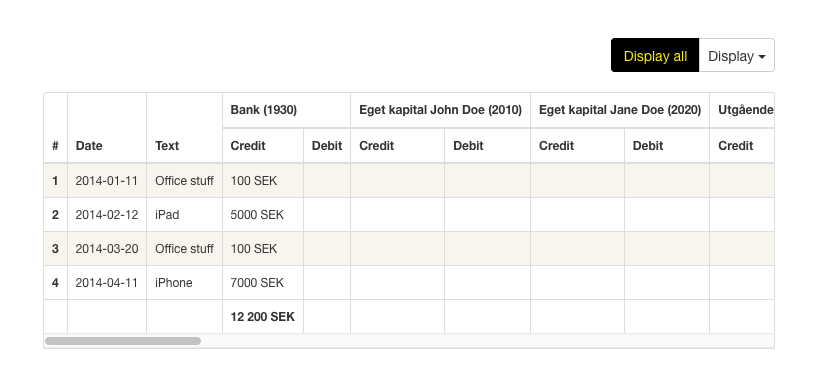

透過選單勾選，可以讓使用者自行選擇想顯示的欄位：

   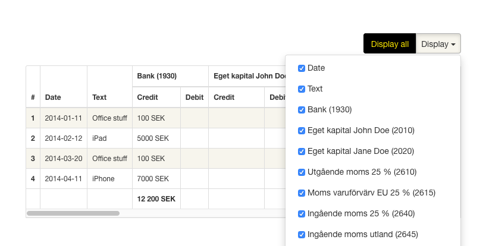

   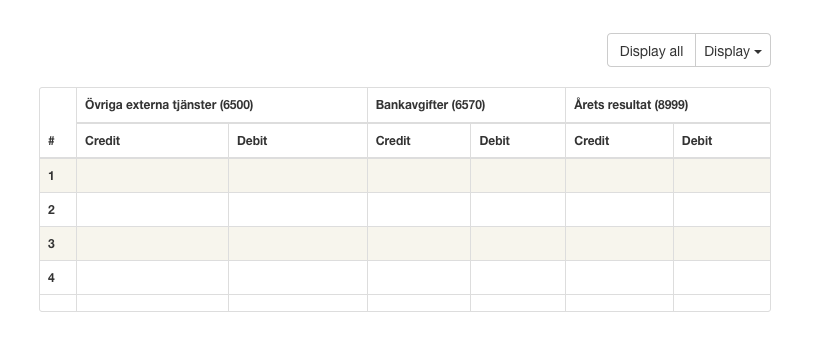

## 特色：<thead>會隨著scroll往下滾動，於table置頂
	
   
	
*  [範例](http://www.milky-sky.com/brangista/tableRwdShare/Bootstrap_TableRwd/index.html)  


## 只有PC才可以使用的表格，手機會有問題：
*  [左右欄位固定範例](https://datatables.net/extensions/colreorder/examples/integration/fixedcolumns.html)  
*  [頂部欄位固定範例](https://datatables.net/extensions/fixedheader/examples/integration/colreorder.html)  
