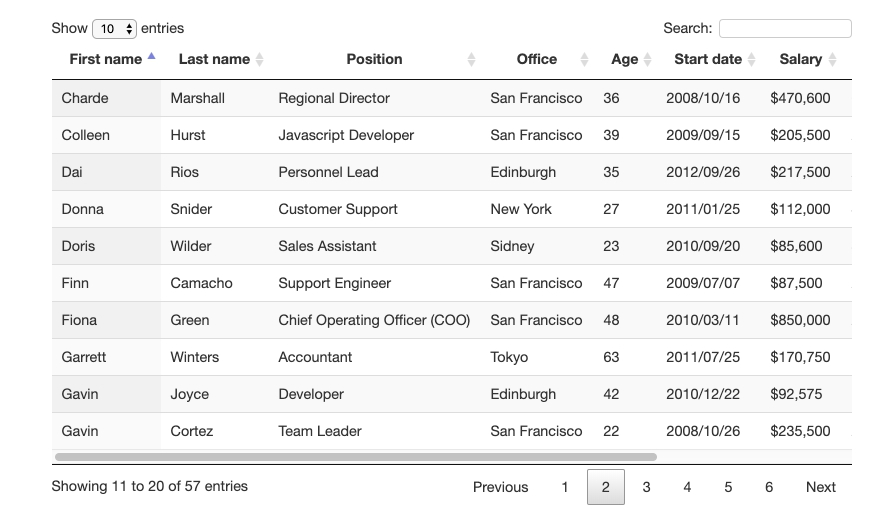

# tableRwd處理方法彙整


## 一：使用css隱藏不重要數據列

處理前：
   
   

處理後：
   
   

實現方式：
```html
    <!-- 增加以下css -->
    @media only screen and (max-width: 800px) {
        table td:nth-child(2),
        table th:nth-child(2) {display: none;}
    }
    @media only screen and (max-width: 640px) {
        table td:nth-child(4),
        table th:nth-child(4),
        table td:nth-child(7),
        table th:nth-child(7),
        table td:nth-child(8),
        table th:nth-child(8){display: none;}
    }
```

## 以用戶角度思考，每個人對數據的認知不同，或許你隱藏的數據對於他卻是很重要的。所以這種方法不推薦。

*  [範例](http://www.milky-sky.com/brangista/tableRwdShare/%E9%9A%B1%E8%97%8F%E4%B8%8D%E9%87%8D%E8%A6%81%E6%95%B8%E6%93%9A%E5%88%97.html)  


## 二：使用破壞表格方式“data-title”

PC狀態


mobile狀態


就是將原本的 thead 隱藏，使用 data-* 以及將 td 用 display: block 來排版。


## 資訊清楚，但可能會產生表格攏長問題。
*  [範例](http://www.milky-sky.com/brangista/tableRwdShare/dataTitle.html)  


## 三：橫向scroll表格

處理後，只要超過指定的table最小寬度，右邊自動會出現透明漸層底：
   
   

scroll滑到最右邊時漸層消失：

   


實現方式：
```html
    <!-- 載入以下css及js -->
    <script type="text/javascript" src="js/jquery.min.js"></script>
    <link rel="stylesheet" type="text/css" media="all" href="css/mainStyle.css" />
    <script type="text/javascript" src="js/pageTable.js"></script>

    <!-- 表格部分的框架 -->
    <div class="container-item">
        <div class="container-block customers">
            <table width="100%" class="customersTable" id="customers">
                ....
            </table>
        </div>
        <div class="red show"></div>
    </div>
```

*  [範例](http://www.milky-sky.com/brangista/tableRwdShare/fglife_TableRwd/scrollX.html)  


## 四：固定左方首列，剩餘列橫向滾動 
   
   


實現方式：
```html
    <!-- 載入以下css及js -->
    <link rel="stylesheet" href="http://netdna.bootstrapcdn.com/bootstrap/3.1.1/css/bootstrap.min.css">
    <link rel="stylesheet" href="css/rwd-table.min.css?v=5.3.1">
    <link rel="stylesheet" href="css/docs.min.css?v=5.3.1">
    <script src="js/jquery1.11.0.js"></script>
    <script src="js/bootstrap3.1.1.js"></script>
    <script src="js/rwd-table.js?v=5.3.1"></script>

    <!-- 表格部分的框架 -->
    <div class="container-item">
        <div class="container-block customers">
            <table width="100%" class="customersTable" id="customers">
                ....
            </table>
        </div>
        <div class="red show"></div>
    </div>
```
## 特色：<thead>會隨著scroll往下滾動，於table置頂

*  [範例](http://www.milky-sky.com/brangista/tableRwdShare/Bootstrap_TableRwd/index.html)  


## 五：固定上方首列，剩餘列橫向滾動，讓使用者自行勾選想隱藏的數據列
   
   

透過選單勾選，可以讓使用者自行選擇想顯示的欄位：

   

   


實現方式：
```html
    <!-- 載入以下css及js -->
    <link rel="stylesheet" href="http://netdna.bootstrapcdn.com/bootstrap/3.1.1/css/bootstrap.min.css">
    <link rel="stylesheet" href="css/rwd-table.min.css?v=5.3.1">
    <link rel="stylesheet" href="css/docs.min.css?v=5.3.1">
    <script src="js/jquery1.11.0.js"></script>
    <script src="js/bootstrap3.1.1.js"></script>
    <script src="js/rwd-table.js?v=5.3.1"></script>

    <!-- 表格部分的框架 -->
    <div class="container-item">
        <div class="container-block customers">
            <table width="100%" class="customersTable" id="customers">
                ....
            </table>
        </div>
        <div class="red show"></div>
    </div>
```
## 特色：<thead>會隨著scroll往下滾動，於table置頂

*  [範例](http://www.milky-sky.com/brangista/tableRwdShare/Bootstrap_TableRwd/index.html)  


## 五：表格內容過多時，使用分頁切換
   
   

透過選單勾選，可以讓使用者自行選擇想顯示的欄位：

## 只有PC才可以使用的表格，手機會有小問題：
*  [左右欄位固定範例](https://datatables.net/extensions/colreorder/examples/integration/fixedcolumns.html)  
*  [頂部欄位固定範例](https://datatables.net/extensions/fixedheader/examples/integration/colreorder.html)  


## Resource

- [The Tumult Youtube channel](https://www.youtube.com/user/TumultHype/videos)

- [Tutorials 官方教學影片](https://tumult.com/hype/tutorials/)

- [Tumult Hype Documentation 說明文件](https://tumult.com/hype/documentation/)
